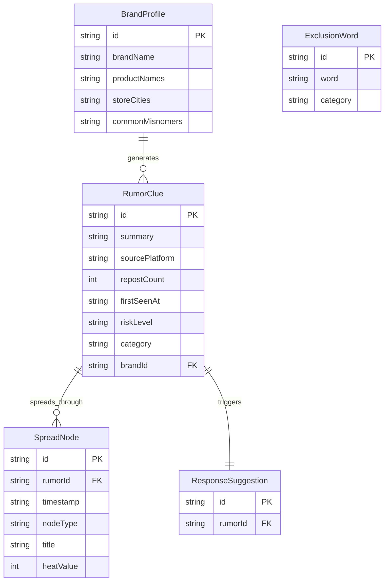

## 1. 架构设计

```mermaid
graph TD
    "前端 React SPA" --> "状态管理 Zustand"
    "状态管理 Zustand" --> "本地存储 LocalStorage"
    "前端 React SPA" --> "Mock数据层"
    "Mock数据层" --> "模拟谣言线索数据"
    "Mock数据层" --> "模拟传播路径数据"
    "Mock数据层" --> "模拟回应建议数据"
```

纯前端应用，所有数据通过 Mock 数据层模拟，品牌信息与排除词等用户配置持久化到 LocalStorage。

## 2. 技术说明

- **前端**：React@18 + TypeScript + Tailwind CSS@3 + Vite
- **初始化工具**：Vite (react-ts 模板)
- **后端**：无（纯前端，Mock 数据）
- **数据库**：无（LocalStorage 持久化用户配置）
- **图表库**：Recharts（热度趋势、受众画像等数据可视化）
- **图标库**：Lucide React（线性图标）
- **动画库**：Framer Motion（节点动画、页面过渡）

## 3. 路由定义

| 路由 | 用途 |
|------|------|
| / | 重定向到 /monitor |
| /monitor | 监测清单页面：品牌信息录入、排除词管理、线索汇总看板 |
| /review | 路径复盘页面：谣言选择、传播路径可视化、节点详情 |
| /response | 回应建议页面：平台账号、客服口径、证据材料、处置进度 |

## 4. API 定义

无后端 API，使用 Mock 数据层模拟。

### 4.1 数据接口定义

```typescript
interface BrandProfile {
  id: string;
  brandName: string;
  productNames: string[];
  storeCities: string[];
  commonMisnomers: string[];
}

interface ExclusionWord {
  id: string;
  word: string;
  category: string;
}

interface RumorClue {
  id: string;
  summary: string;
  sourcePlatform: string;
  repostCount: number;
  firstSeenAt: string;
  riskLevel: 'high' | 'medium' | 'low';
  category: 'unknown_source_fast_spread' | 'old_content_repackaged' | 'competitor_topic_embedded' | 'other';
  brandId: string;
  relatedProductName: string;
}

interface SpreadNode {
  id: string;
  rumorId: string;
  timestamp: string;
  nodeType: 'small_circle' | 'marketing_account' | 'local_community' | 'mainstream_media' | 'official_response';
  title: string;
  screenshotUrl: string;
  linkUrl: string;
  heatValue: number;
  audienceProfile: {
    ageDistribution: { range: string; percentage: number }[];
    topRegions: string[];
    interestTags: string[];
  };
}

interface ResponseSuggestion {
  id: string;
  rumorId: string;
  platformAccounts: {
    platform: string;
    accountName: string;
    contactInfo: string;
    priority: 'urgent' | 'high' | 'normal';
  }[];
  customerServiceScripts: {
    keyPoint: string;
    detail: string;
  }[];
  evidenceMaterials: {
    type: string;
    description: string;
    relevance: 'high' | 'medium' | 'low';
  }[];
  actionItems: {
    id: string;
    content: string;
    status: 'pending' | 'in_progress' | 'completed';
  }[];
}
```

## 5. 服务端架构

不适用（纯前端应用）

## 6. 数据模型

### 6.1 数据模型定义



### 6.2 数据定义语言

使用 LocalStorage 存储用户配置，Mock 数据层提供预设的谣言线索、传播节点和回应建议数据。

```sql
-- 概念模型（实际使用 LocalStorage + Mock）
CREATE TABLE brand_profiles (
  id TEXT PRIMARY KEY,
  brandName TEXT NOT NULL,
  productNames TEXT,
  storeCities TEXT,
  commonMisnomers TEXT
);

CREATE TABLE exclusion_words (
  id TEXT PRIMARY KEY,
  word TEXT NOT NULL,
  category TEXT
);

CREATE TABLE rumor_clues (
  id TEXT PRIMARY KEY,
  summary TEXT,
  sourcePlatform TEXT,
  repostCount INTEGER,
  firstSeenAt TEXT,
  riskLevel TEXT CHECK(riskLevel IN ('high','medium','low')),
  category TEXT,
  brandId TEXT REFERENCES brand_profiles(id)
);

CREATE TABLE spread_nodes (
  id TEXT PRIMARY KEY,
  rumorId TEXT REFERENCES rumor_clues(id),
  timestamp TEXT,
  nodeType TEXT,
  title TEXT,
  heatValue INTEGER
);

CREATE TABLE response_suggestions (
  id TEXT PRIMARY KEY,
  rumorId TEXT REFERENCES rumor_clues(id)
);
```
